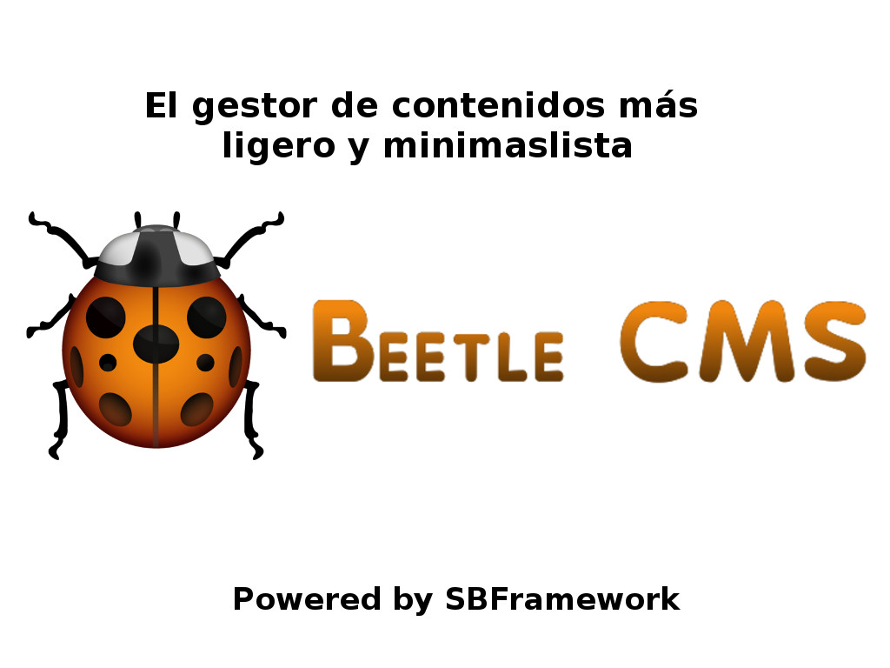

# BeetleCMS
A very lightweight and minimalist CMS

The CMS is built over SBFramework and the main goal is to give to users a CMS capable to run into a server with very low resources.

Main Features
<ul>
  <li>Backend</li>
  <li>Modules Management</li>
  <li>Template Engine for backend and frontend</li>
  <li>Navigation Menus Builder</li>
  <li>Pages Builder integrated with TinyMCE</li>
  <li>Users and Roles management</li>
  <li>Form Builder</li>
  <li>Native Bootstrap Support (V3.3.5)</li>
  <li>Backups module</li>
  <li>Multimedia Storage and Uploader</li>
</ul>
